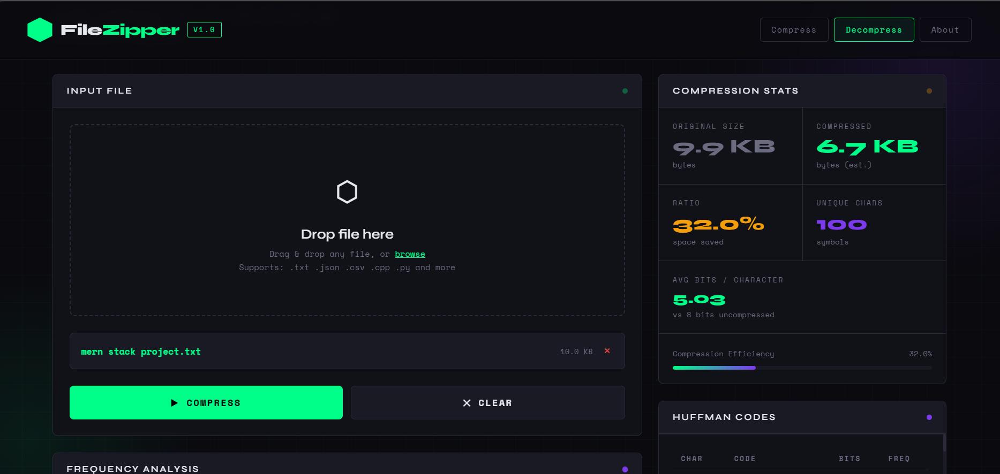

# FileZipper – Huffman Encoding Tool

A modern **file compression and visualization tool** built using the Huffman Coding algorithm.  
FileZipper compresses text files using optimal prefix-free codes and provides an interactive web interface to **analyze frequency distribution, visualize the Huffman tree, and inspect generated codes**.

This project demonstrates core concepts from **Data Structures, Algorithms, and System Programming**.

---

## Project Overview

FileZipper implements **Huffman-based lossless compression** with a C++ backend and an interactive web frontend.

The system:

1. Reads an input file
2. Builds a character frequency table
3. Constructs a Huffman Tree
4. Generates optimal binary codes
5. Compresses the file into a `.huff` binary format
6. Allows decompression to restore the original file

The frontend also visualizes the compression process in real time.

The compression algorithm is based on **:contentReference[oaicite:0]{index=0}**.

---

# Features

### Compression
- Huffman encoding based file compression
- Generates binary `.huff` files
- Bit-level packing for efficient storage

### Decompression
- Restores original file from `.huff`
- Rebuilds Huffman tree using stored frequency table

### Visualization (Frontend)
- Character frequency analysis
- Huffman code table
- Interactive Huffman tree visualization
- Compression statistics dashboard

### System Design
- Modular C++ backend
- Separate visualization frontend
- Deterministic tree generation
- Binary file format with metadata

---

# Tech Stack

### Backend
- C++
- STL Data Structures
- File Streams
- Bit Manipulation

### Build Tools
- CMake

### Frontend
- HTML
- Canvas API (tree visualizer)

### Testing
- Google Test

---

# Project Structure
```text
FileZipper/
├── CMakeLists.txt
├── README.md
├── include/
│ ├── huffman_tree.h
│ ├── compressor.h
│ └── decompressor.h
│
├── src/
│ ├── main.cpp
│ ├── huffman_tree.cpp
│ ├── compressor.cpp
│ └── decompressor.cpp
│
├── tests/
│ └── huffman_tests.cpp
│
└── frontend/
└── index.html
```

---

# Huffman Compression Workflow
```text
Input File
│
▼
Character Frequency Table
│
▼
Priority Queue (Min Heap)
│
▼
Huffman Tree Construction
│
▼
Prefix-Free Code Generation
│
▼
Bitstream Encoding
│
▼
Compressed .huff File
```


---

# Screenshots

## Compression Interface



Users can drag and drop files to analyze compression statistics.

---

## Frequency Analysis


Displays the most frequent characters and their distribution.

---

## Huffman Tree Visualization


Interactive visualization of the generated Huffman tree.

---

# Build Instructions

### 1. Clone Repository

```bash
git clone https://github.com/Shreyash-Pathare/FileZipper-.git
cd FileZipper-
```
### 2. Build Using CMake
```bash
mkdir build
cd build
cmake ..
make
```
### 3. Run Program
```bash
./filezipper compress input.txt output.huff
```

### Decompress
```bash
./filezipper decompress output.huff original.txt
```

---

# Future Improvements
- Folder compression

- Streaming compression

- Multi-file archive support

- Performance benchmarking

- WebAssembly backend

- Interactive tree animation

---

# Author
Shreyash Pathare  
Computer Science Student
